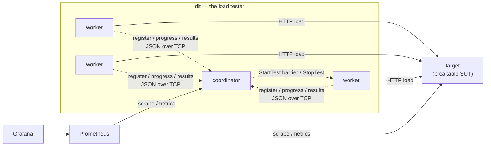

# dlt — Distributed Load Tester

A distributed HTTP load tester in Go: a **coordinator** dispatches work to **N
horizontally-scaled workers** that hammer a **deliberately-breakable target**, and their
results are aggregated into **statistically correct global latency percentiles**. Built as a
hands-on distributed-systems + DevOps project — and documented like production: every
non-trivial decision has an [ADR](docs/decisions/).

> ⚠️ **Ethics:** this generates DDoS-shaped traffic. Point it **only** at the bundled `target`
> on infrastructure you own. [Details →](docs/SPEC.md#ethics--safety-non-negotiable)

## The interesting part

Naively averaging each worker's p99 gives you a **wrong** global p99 — the mean of percentiles
is not a percentile. dlt instead ships a **serialized histogram** from each worker and
**merges** them, computing percentiles from the merged distribution. Correct, at bounded
network cost regardless of request volume.

→ [ADR-0002: merged histograms over averaged percentiles](docs/decisions/0002-merged-histograms-over-averaged-percentiles.md)

## Architecture



Full component/sequence diagrams and the pod model: [docs/ARCHITECTURE.md](docs/ARCHITECTURE.md).

## Quickstart

```bash
# run the deliberately-breakable target
go run ./cmd/target -c configs/target.yaml

# build / vet / test (race detector on)
go build ./... && go vet ./... && go test -race ./...
```

## Documentation

| Doc | What it answers |
|---|---|
| [SPEC](docs/SPEC.md) | **What** — requirements, contracts, config, ethics |
| [ARCHITECTURE](docs/ARCHITECTURE.md) | **How** — components, diagrams, pod model, observability |
| [ROADMAP](docs/ROADMAP.md) | **Order** — 9-phase build plan + definition of done |
| [decisions/](docs/decisions/) | **Why** — the ADR trail (start with 0002) |

Full index: [docs/README.md](docs/README.md).

## Status

**Phase 1 of 9 — in progress.** Target server up; fault model implemented + tested; latency
model next. Live status in [docs/ROADMAP.md](docs/ROADMAP.md).

## Authorship

A learning project with an honest split: **business logic and behavior are written by
[@adssib](https://github.com/adssib); scaffolding, plumbing, and tests by Claude Code**
(co-authored in the git history). The working agreement is in [CLAUDE.md](CLAUDE.md).
