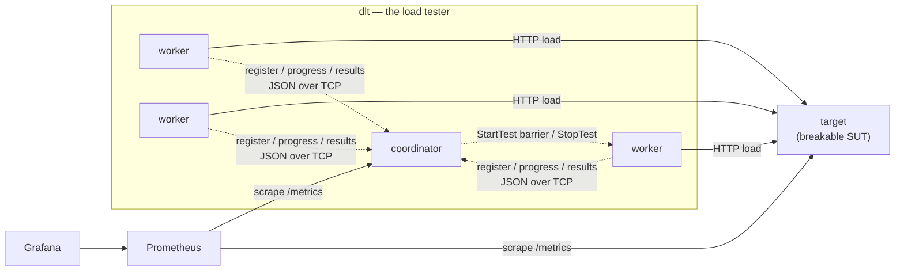
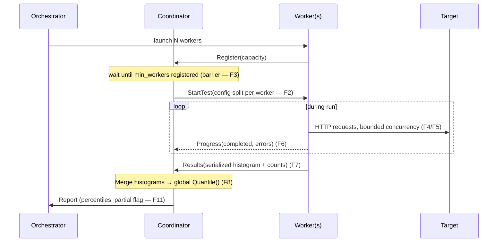

# dlt — Architecture

> *How* the system is shaped and why the pieces sit where they do. The fixed contracts are
> in [SPEC.md](SPEC.md); the reasoning behind each choice is in [decisions/](decisions/).

## Components & process model

Two programs, three roles:

- **`dlt`** — one binary, two role subcommands: `dlt coordinator`, `dlt worker`, plus a
  local launcher `dlt test`. (See [ADR-0001](decisions/0001-one-binary-two-roles.md).)
- **`target`** — a separate program: the deliberately-breakable system-under-test ("defender").



### Test lifecycle



### Pod / deployment model (Kubernetes)

| Role | k8s shape | Notes |
|---|---|---|
| coordinator | 1 Deployment (1 replica) **+ Service** | Stable DNS (`coordinator:7070`) so workers can find it. |
| worker | 1 Deployment, **N replicas** | Scaled via `kubectl scale`; fungible; no Service (they dial *out*). |
| target | 1 Deployment **+ Service** | The system under test. |

**Who owns "how many workers": the *orchestrator*, never the coordinator**
([ADR-0003](decisions/0003-orchestrator-owns-worker-count.md)).
- local: `dlt test --workers N` · compose: `--scale worker=N` · k8s: `replicas:` / `kubectl scale`

The coordinator only knows `min_workers` — a **readiness barrier** (don't start until N
workers registered). This avoids a two-sources-of-truth conflict with the orchestrator.

## Dependencies (deliberately thin)

- stdlib `net` / `net/http` — TCP transport + HTTP load generation.
- `github.com/HdrHistogram/hdrhistogram-go` — default mergeable histogram.
- `github.com/prometheus/client_golang` — metrics export.
- `gopkg.in/yaml.v3` — config files.
- **`tsenart/vegeta` — read as a reference, NOT a dependency** — the engine is hand-written
  ([ADR-0006](decisions/0006-handwritten-load-engine.md)).

## Observability model (F12)

- **Pull-based:** components expose `/metrics`; Prometheus scrapes → Grafana visualizes.
- **Stable scrape targets** (long-lived, have Services): **coordinator** (live aggregate from
  the `Progress` stream) and **target** (served / throttled / 5xx rates). Workers are optional.
- **Critical boundary:** Prometheus/Grafana are the **live** view only. **Authoritative final
  percentiles come from the merged histograms** in the coordinator's report — PromQL cannot do
  a correct cross-worker percentile merge, which is *why* the histogram centerpiece exists
  ([ADR-0005](decisions/0005-prometheus-live-histograms-authoritative.md)).

## Requirement → location traceability

| Req | Lives in |
|---|---|
| F1 membership / registration | `coordinator/registry.go`, `worker/worker.go` |
| F2 distribute config | `coordinator/planner.go` + `protocol` |
| F3 synchronized start | `coordinator/coordinator.go` (broadcast barrier) |
| F4 bounded concurrency | `loadgen/engine.go` (semaphore) |
| F5 per-request measurement | `loadgen/engine.go` |
| F6 progress stream | `worker` → `protocol.Progress` → `coordinator` |
| **F7/F8 merge + correct percentiles** | `histogram/` + `coordinator/report.go` |
| F9 ramp-up | `loadgen/rampup.go` |
| F10 configurable (YAML) | `internal/config` + `configs/` |
| F11 graceful worker death | `coordinator/coordinator.go` (survivor set + partial flag) |
| F12 metrics → Prometheus/Grafana | `internal/metrics` + `observability/` |
| F13 rate limiter | `internal/target/ratelimit/` + `loadgen/outcome.go` |
| Realistic target (latency/faults) | `internal/target/behavior.go` |

## Folder structure

```
dlt/
├── cmd/
│   ├── dlt/main.go           # subcommand dispatch: coordinator | worker | test
│   └── target/main.go        # the breakable target server
├── internal/
│   ├── config/               # F10 — YAML → typed config; Duration wrapper
│   ├── protocol/             # F2,F6,F7 — wire types + newline-JSON codec over net.Conn
│   ├── coordinator/          # registry, planner, coordinator, report
│   ├── worker/               # register → await StartTest → run loadgen → stream → results
│   ├── loadgen/              # F4,F5,F9 — THE engine (author-written): engine, rampup, outcome
│   ├── histogram/            # F8 — THE centerpiece: Histogram interface + HDR impl
│   ├── metrics/              # F12 — prometheus collectors + /metrics
│   ├── launcher/             # `dlt test` — local orchestrator
│   └── target/               # the defender: server, behavior, ratelimit/ (F13)
├── configs/                  # coordinator.yaml, worker.yaml, target.yaml
├── deploy/                   # compose/ (P6), k8s/ (P7), helm/ (P7)
├── observability/            # prometheus/, grafana/ (P8)
└── docs/                     # SPEC, ARCHITECTURE, ROADMAP, decisions/
```

## Assumptions & risks (on the record)

- **No cross-worker clock sync.** Each worker measures *its own* latencies; results merge by
  **count** (histograms), never by comparing timestamps across machines. This is *why* merged
  histograms are correct and averaging percentiles is not.
- **Workers are fungible and stateless** → they scale horizontally and any subset can die (F11).
- **Single coordinator (SPOF).** Accepted: it's a test tool — on coordinator loss you restart
  and rerun. HA is explicitly out of scope.
- **Trusted network, no TLS.** Tester and target sit on the same owned network (see ethics).
- **Single-machine contention caps throughput** — this is a home-lab learning tool, not
  internet-scale.
- **Known bug-class:** `math/rand.Rand` is not concurrency-safe; the target's `behavior.rng`
  must be guarded before it's used under concurrent load. `go test -race` guards this in CI.
